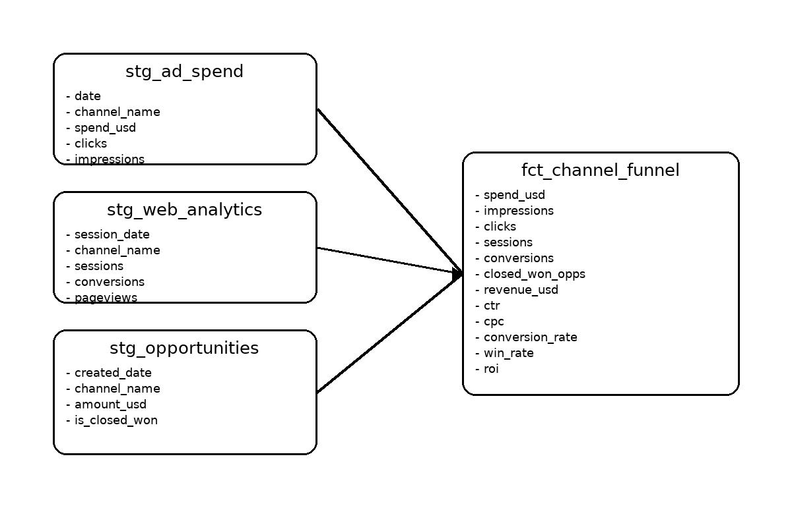

# Step 2 – Dimensional Model Diagram & Metric Definitions

## Overview
This section outlines the dimensional model used in the project and provides clear definitions for each core metric included in the final channel-level funnel table.

The goal is to create a structure that is:
- easy to interpret,
- aligned with typical analytics engineering patterns,
- appropriate for the constraints of the sample datasets (no user-level join keys),
- optimized for funnel-style reporting.

---
## Core GTM Metrics

### 1. Click-Through Rate (CTR)
**Definition:** Percentage of impressions that result in clicks
**Calculation:**
```sql
clicks / impressions
```
**Business use:** Measures ad creative effectiveness

### 2. Cost Per Click (CPC)
**Definition:** Average cost to acquire a click
**Calculation:**
```sql
spend_usd / clicks
```
**Business use:** Efficiency metric for paid channel optimization

### 3. Conversion Rate
**Definition:** Percentage of sessions that result in conversions
**Calculation:**
```sql
conversions / sessions
```
**Business use:** Measures landing page/website effectiveness

### 4. Win Rate
**Definition:** Percentage of opportunities that close as won
**Calculation:**
```sql
closed_won_opps / total_opps
```
**Business use:** Sales efficiency and pipeline quality

### 5. Return on Investment (ROI)
**Definition:** Net return per dollar spent
**Calculation:**
```sql
(revenue_usd - spend_usd) / spend_usd
```
**Business use:** Overall channel profitability
## Dimensional Model (Channel-Level)

### Entities & Relationships



## Table Grains

**Staging Tables:**
- `stg_ad_spend`: One row per channel + date + campaign
- `stg_web_analytics`: One row per channel + date + campaign (aggregated from sessions)
- `stg_opportunities`: One row per opportunity

**Fact Table:**
- `fct_channel_funnel`: One row per channel (aggregated across all time)

**Join Logic:**
The final funnel table uses a UNION of all channels from the three staging models, then left joins each source to ensure complete channel coverage even when channels don't appear in all data sources.


