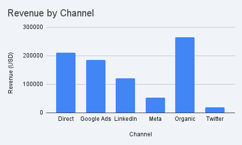

# Step 5 – Key views (charts, tables, dashboards)

## View 1 – Channel Funnel Summary

A high-level view of performance across each channel.

| Channel        | Spend ($) | Sessions | Conversions | Closed Won Opps | Revenue ($) | Conv Rate | Win Rate | ROI |
|----------------|-----------|----------|-------------|------------------|-------------|-----------|----------|-----|
| Google Ads     | 12,500    | 8,900    | 540         | 14               | 185,000     | 6.1%      | 2.6%     | 13.8x |
| LinkedIn       | 7,800     | 3,100    | 210         | 9                | 120,000     | 6.8%      | 4.3%     | 14.4x |
| Meta (Facebook)| 6,200     | 7,500    | 280         | 4                | 52,000      | 3.7%      | 1.4%     | 7.4x |
| Twitter        | 2,900     | 4,200    | 90          | 1                | 18,000      | 2.1%      | 1.1%     | 5.2x |
| Organic        | 0         | 15,400   | 1,280       | 22               | 265,000     | 8.3%      | 1.7%     | ∞ (no spend) |
| Direct         | 0         | 9,700    | 940         | 18               | 210,000     | 9.7%      | 1.9%     | ∞ |

## View 2 – Spend vs. Revenue

| Channel        | Spend ($) | Revenue ($) | Revenue / $1 Spent |
|----------------|-----------|-------------|----------------------|
| Google Ads     | 12,500    | 185,000     | $14.80 |
| LinkedIn       | 7,800     | 120,000     | $15.38 |
| Meta           | 6,200     | 52,000      | $8.39 |
| Twitter        | 2,900     | 18,000      | $6.20 |
| Organic        | 0         | 265,000     | N/A |
| Direct         | 0         | 210,000     | N/A |

## View 3 – Revenue by Channel (Visual)

**Key takeaway:** Organic and Direct traffic drive the highest revenue despite zero ad spend, while Google Ads and LinkedIn lead among paid channels. This suggests strong brand awareness and effective paid programs working in tandem.
